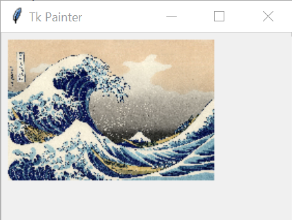
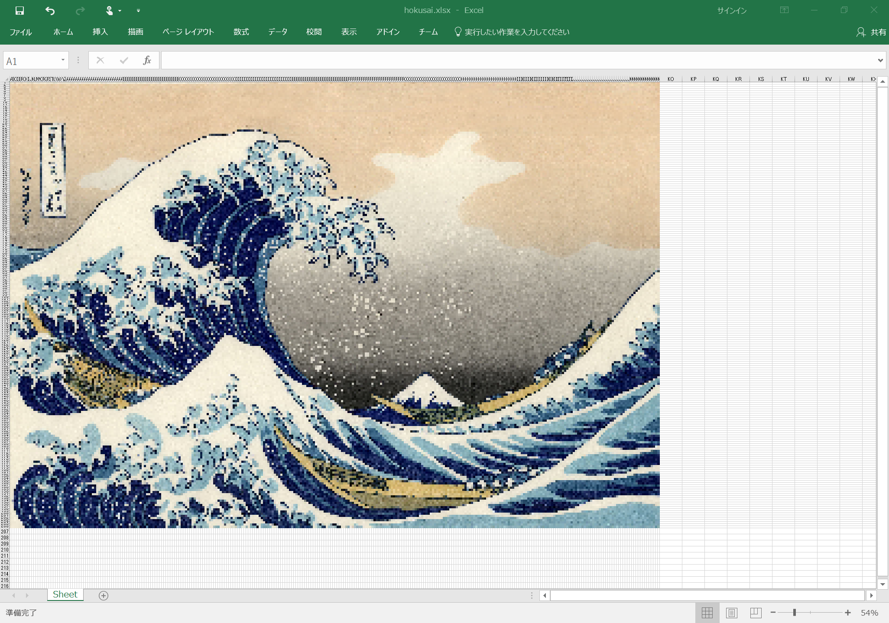
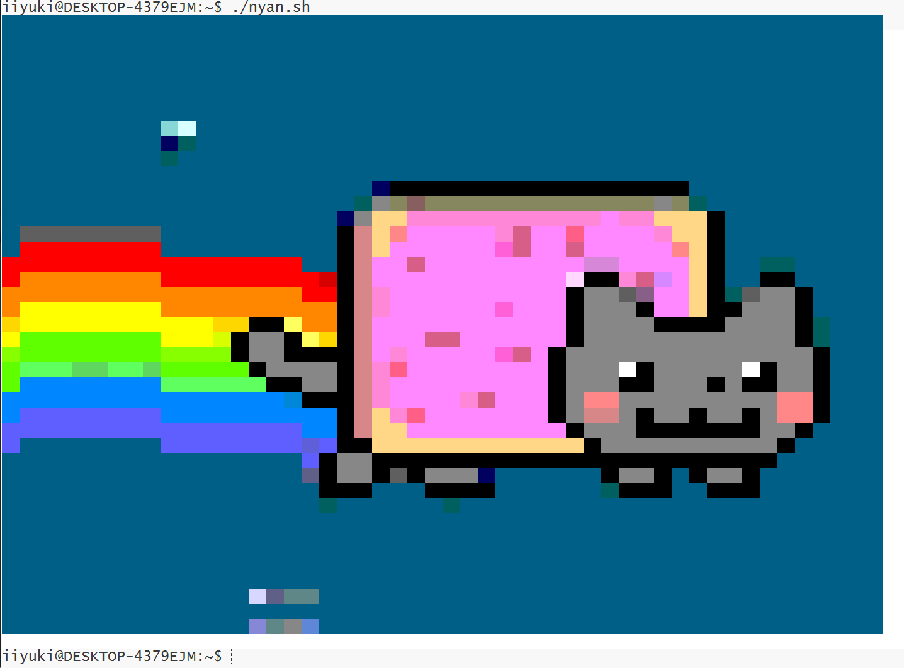

# PaintBasics

A base class for painting program in python.

pythonで絵を描くプログラムのための基底クラスです。







## Demo

Command below generates a html source code, a shell script, and a excel file that shows your_image.jpg. You can modify width of the generating image with -n option.

以下のコマンドを実行すると、your_image.jpgを描くhtmlソースコード, シェルスクリプト, エクセルファイルが作られます。-nオプションで作られる画像を幅を指定できます。

```bash
python FromImage.py your_image.jpg -n 100
```

Command below generates a html source code, a shell script, and a excel file that shows simple geometric figures.

以下のコマンドを実行すると、簡単な幾何学図形を描くhtmlソースコード, シェルスクリプト, エクセルファイルが作られます。

```bash
python DrawFigure.py
```
